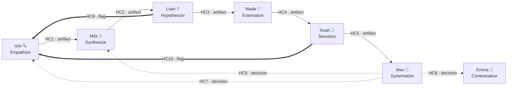

# Compass Routing Reference — Vortex Pattern

> **Status:** Authoritative | **Version:** 1.0 | **Created:** 2026-02-24 | **Framework:** v1.6.0
>
> This is the **authoritative** routing reference for the Vortex Pattern. The routing table in `architecture.md` is a point-in-time snapshot only (P22). All step-file Compass sections MUST reference this document for routing decisions.

---

## Vortex Overview

The Vortex Pattern's agents, streams and handoff contracts are enumerated in `docs/agents.md` and in `scripts/update/lib/agent-registry.js`, which are the source of truth for the diagram below:



**Contract Types:**
- **HC1–HC5** (solid lines): Artifact contracts — agent produces a schema-compliant artifact file
- **HC6–HC8** (dashed lines): Decision-driven routing — Max routes based on strategic evidence
- **HC9–HC10** (thick lines): Flag-driven routing — mid-workflow flag triggers Compass guidance

---

## Routing Mechanisms

Each route uses one of three mechanisms. Step-file authors should match the Compass UX to the mechanism type.

| Mechanism | Description | Contracts | Compass Row Pattern |
|-----------|-------------|-----------|-------------------|
| **Schema-driven** | Artifact produced, schema declares target | HC1–HC5 | "Your [artifact type] is ready for [Agent] — they expect [HC schema]" |
| **Decision-driven** | Max makes strategic routing decision | HC6, HC7, HC8 | "Based on evidence, route to [Agent] for [action]" |
| **Flag-driven** | Mid-workflow flag triggers routing | HC9, HC10 | "Flagged: [issue] → consider routing to [Agent]" |

**Note on HC9/HC10 (Wave 3.0):** These ship as Compass guidance rows in the source agent's final step. A full mid-workflow interrupt pattern is deferred to Wave 3.1 (architecture D5, P2).

---

## Three-Way Routing Distinction (FR20)

When evidence suggests the current direction needs change, Compass must distinguish three scenarios. This distinction appears in multiple agents' Compass steps — Emma is read-only in Wave 3 (A4).

### Decision Criteria

| Scenario | Route To | Trigger | Key Question |
|----------|----------|---------|-------------|
| **New problem space** | Emma 🎯 `contextualize-scope` | Evidence reveals the problem itself is wrong | "Is the problem we're solving the wrong problem entirely?" |
| **Reframe within known space** | Mila 🔬 `research-convergence` | Problem is correct, but synthesis needs revision | "Is the problem right but our pains/gains/JTBD framing wrong?" |
| **Zoom out** | Emma 🎯 `contextualize-scope` | Current scope is too narrow, need wider context | "Are we looking at too small a piece of the problem?" |

### Decision Flowchart

```
Is the fundamental problem wrong?
├── YES → Emma 🎯 (contextualize-scope) — "New problem space"
│         HC8 if coming from Max
└── NO → Is the problem scope too narrow?
          ├── YES → Emma 🎯 (contextualize-scope) — "Zoom out"
          │         HC8 if coming from Max
          └── NO → Does the JTBD/pains/gains framing need revision?
                    ├── YES → Mila 🔬 (research-convergence or pivot-resynthesis) — "Reframe"
                    │         HC6 if coming from Max
                    └── NO → Continue forward in current Vortex direction
```

### Examples

1. **New problem space:** "We spent 3 sprints on faster checkout. Production data shows users don't abandon at checkout — they abandon at product comparison. The problem is navigation, not checkout." → **Emma** (new problem space)

2. **Reframe within known space:** "Our JTBD for onboarding is correct (users want to feel productive fast), but our assumed pains were wrong. Users don't struggle with the UI — they struggle with understanding which features to try first." → **Mila** (reframe pains/gains)

3. **Zoom out:** "We scoped to mobile-only users but production signals show 40% of the behavior comes from tablet users we excluded from our scope." → **Emma** (widen scope)

---

## Handoff Contract Reference

### Artifact Contracts (HC1–HC5)

These contracts have schema definitions in `_bmad/bme/_vortex/contracts/`. Each artifact produced by the source agent must conform to the schema.

| Contract | Flow | Schema File | Expected Artifact | Trigger Condition |
|----------|------|-------------|-------------------|-------------------|
| **HC1** | Isla 🔍 → Mila 🔬 | `contracts/hc1-empathy-artifacts.md` | Empathy artifacts (maps, interviews, observations) with synthesized insights, key themes, pain points, desired gains | Discovery research complete; one or more artifacts ready for convergence |
| **HC2** | Mila 🔬 → Liam 💡 | `contracts/hc2-problem-definition.md` | Converged problem definition (JTBD + Pains & Gains) with evidence summary and assumptions | Problem synthesized from Isla artifacts; single actionable problem statement produced |
| **HC3** | Liam 💡 → Wade 🧪 | `contracts/hc3-hypothesis-contract.md` | 1–3 hypothesis contracts in 4-field format (expected outcome, behavior change, rationale, riskiest assumption) with risk map | Hypotheses engineered; riskiest assumptions identified and prioritized |
| **HC4** | Wade 🧪 → Noah 📡 | `contracts/hc4-experiment-context.md` | Graduated experiment context (results, success criteria, metrics, confirmed/rejected hypotheses, production readiness) | Experiment graduated to production; results and baselines captured |
| **HC5** | Noah 📡 → Max 🧭 | `contracts/hc5-signal-report.md` | Signal report (signal description + experiment lineage context + trend analysis) — intelligence only, no strategic recommendations | Production signal interpreted through experiment lineage; signal ready for Max's decision |

### Routing Contracts (HC6–HC10)

These contracts have **no artifact file** — they are Compass table guidance entries that carry decision context in conversation (architecture D2). This section is their authoritative definition.

| Contract | Flow | Routing Type | Trigger Condition | What the Target Agent Receives |
|----------|------|-------------|-------------------|-------------------------------|
| **HC6** | Max 🧭 → Mila 🔬 | Decision-driven | Max's pivot-patch-persevere decides "pivot": problem is correct but solution direction failed | Mila receives: original Isla artifacts + new evidence from failed experiments. Re-synthesizes pains/gains while preserving the JTBD. |
| **HC7** | Max 🧭 → Isla 🔍 | Decision-driven | Max's vortex-navigation identifies critical evidence gap that needs discovery research | Isla receives: specific questions to investigate + context on what evidence is missing and why it matters. |
| **HC8** | Max 🧭 → Emma 🎯 | Decision-driven | Max determines the fundamental problem space needs recontextualization — either wrong problem or scope too narrow | Emma receives: evidence that triggered recontextualization + current Vortex state summary. |
| **HC9** | Liam 💡 → Isla 🔍 | Flag-driven | During hypothesis engineering, Liam flags an unvalidated assumption that is too risky to test without prior validation (FR10) | Isla receives: the specific assumption to validate + the hypothesis it supports + why it's flagged (lethality × uncertainty). |
| **HC10** | Noah 📡 → Isla 🔍 | Flag-driven | During signal interpretation, Noah detects unexpected user behavior not covered by the original experiment hypothesis (FR15, FR16) | Isla receives: anomaly description + how it deviates from experiment expectations + suggested discovery focus questions. |

---

## Insufficient Evidence Guidance (FR18)

When a workflow's final step cannot determine the appropriate Compass route, use this pattern:

### When to Use

- User has not completed enough of the workflow to produce meaningful routing evidence
- Results are ambiguous — no clear signal pointing to a specific next agent
- Multiple routes seem equally valid with no differentiating evidence

### Template for Step-File Authors

```markdown
### ⚠️ Insufficient Evidence for Routing

The evidence gathered so far doesn't clearly point to a single next step. Before choosing a direction:

**Evidence needed for each route:**

| To route to... | You need... |
|----------------|-------------|
| [Agent A] | [Specific evidence or artifact that would justify this route] |
| [Agent B] | [Specific evidence or artifact that would justify this route] |
| [Agent C] | [Specific evidence or artifact that would justify this route] |

**Recommended:** Revisit [specific workflow step] to strengthen your evidence, or run **Max's [VN] Vortex Navigation** for a full gap analysis.
```

### Evidence Requirements Per Agent Transition

| Target Agent | Minimum Evidence Required |
|-------------|-------------------------|
| Emma 🎯 | Clear signal that the problem space or scope needs fundamental change |
| Isla 🔍 | Identified knowledge gap, unvalidated assumption, or anomalous behavior requiring investigation |
| Mila 🔬 | Multiple research artifacts ready for convergence, or evidence that current problem framing needs revision |
| Liam 💡 | Converged problem definition with clear JTBD, pains, and gains |
| Wade 🧪 | At least one hypothesis contract with identified riskiest assumption and proposed experiment |
| Noah 📡 | Graduated experiment with production metrics, baselines, and monitoring criteria |
| Max 🧭 | Signal report, learning card, or accumulated evidence requiring strategic decision |

---

## User Override (FR22)

Users can override any Compass recommendation and navigate to any agent directly. The Compass provides evidence-based guidance, not mandatory instructions. Step-file authors should include:

```markdown
> **Note:** These are evidence-based recommendations. You can navigate to any Vortex agent at any time
> based on your judgment. Run **Max's [VN] Vortex Navigation** to see all available options.
```

---

## Complete Routing Decision Matrix

This compact table maps every workflow to its recommended routing targets.

### Emma 🎯 — Contextualize (Stream 1)

| Workflow | Route 1 | Route 2 | Route 3 |
|----------|---------|---------|---------|
| `contextualize-scope` | → Emma 🎯 `lean-persona` — Scope defined, understand who exists in this space | → Isla 🔍 `user-interview` — Scope chosen, validate with real users | → Wade 🧪 `mvp` — Ready to test scope assumptions |
| `lean-persona` | → Wade 🧪 `lean-experiment` — Riskiest persona assumptions identified | → Isla 🔍 `user-interview` — Validate persona with actual users | → Isla 🔍 `empathy-map` — Multiple segments need deeper understanding |
| `product-vision` | → Emma 🎯 `lean-persona` — Vision clear, users are not | → Wade 🧪 `lean-experiment` — Strategic assumptions need testing | → Isla 🔍 `user-discovery` — User needs assumed, not researched |

### Isla 🔍 — Empathize (Stream 2)

| Workflow | Route 1 | Route 2 | Route 3 |
|----------|---------|---------|---------|
| `empathy-map` | → Mila 🔬 `research-convergence` — Multiple artifacts ready for synthesis (HC1) | → Wade 🧪 `lean-experiment` — Pain points need behavioral validation | → Isla 🔍 `user-interview` — Deeper understanding needed |
| `user-discovery` | → Mila 🔬 `research-convergence` — Discovery findings ready for convergence (HC1) | → Wade 🧪 `lean-experiment` — Ready to test hypotheses from discovery | → Isla 🔍 `empathy-map` — Map key users discovered in depth |
| `user-interview` | → Mila 🔬 `research-convergence` — Interview insights ready for synthesis (HC1) | → Wade 🧪 `lean-experiment` — Riskiest insight ready for testing | → Isla 🔍 `empathy-map` — Synthesize patterns across interview subjects |

### Mila 🔬 — Synthesize (Stream 3)

| Workflow | Route 1 | Route 2 | Route 3 |
|----------|---------|---------|---------|
| `research-convergence` | → Liam 💡 `hypothesis-engineering` — Problem converged, ready for hypothesis (HC2) | → Isla 🔍 `user-discovery` — Gaps found, more discovery needed | → Emma 🎯 `contextualize-scope` — Problem space itself is wrong (three-way: new problem) |
| `pivot-resynthesis` | → Liam 💡 `hypothesis-engineering` — Revised problem definition ready (HC2) | → Isla 🔍 `user-interview` — Assumptions from pivot need validation | |
| `pattern-mapping` | → Mila 🔬 `research-convergence` — Patterns identified, proceed to full synthesis | → Liam 💡 `hypothesis-engineering` — Patterns already point to clear problem (HC2) | → Isla 🔍 `user-discovery` — Patterns reveal knowledge gaps |

### Liam 💡 — Hypothesize (Stream 4)

| Workflow | Route 1 | Route 2 | Route 3 |
|----------|---------|---------|---------|
| `hypothesis-engineering` | → Wade 🧪 `lean-experiment` — Hypothesis contracts ready for testing (HC3) | → Isla 🔍 `user-interview` — ⚡ Unvalidated assumption flagged (HC9) | |
| `assumption-mapping` | → Isla 🔍 `user-discovery` — High-risk assumptions need validation | → Wade 🧪 `lean-experiment` — Assumptions acceptable, proceed to test (HC3) | → Liam 💡 `hypothesis-engineering` — Refine hypotheses based on risk map |
| `experiment-design` | → Wade 🧪 `lean-experiment` — Experiment design ready for execution (HC3) | → Liam 💡 `hypothesis-engineering` — Revise hypothesis based on design constraints | → Isla 🔍 `user-interview` — Pre-experiment validation needed |

### Wade 🧪 — Externalize (Stream 5)

| Workflow | Route 1 | Route 2 | Route 3 |
|----------|---------|---------|---------|
| `lean-experiment` | → Max 🧭 `learning-card` — Experiment complete, capture learning | → Noah 📡 `signal-interpretation` — Experiment graduated, monitor production (HC4) | → Isla 🔍 `empathy-map` — User behavior surprising, investigate |
| `proof-of-concept` | → Wade 🧪 `proof-of-value` — Technically feasible, validate business case | → Wade 🧪 `lean-experiment` — Feasibility uncertain, focused technical test | → Max 🧭 `learning-card` — Document technical learnings |
| `proof-of-value` | → Max 🧭 `learning-card` — Business value validated, capture evidence | → Isla 🔍 `user-interview` — Value unclear, understand willingness | → Max 🧭 `pivot-patch-persevere` — Pivot decision needed |
| `mvp` | → Wade 🧪 `lean-experiment` — MVP designed, execute build-measure-learn | → Isla 🔍 `user-interview` — Validate user need before building | → Max 🧭 `learning-card` — MVP results available, capture learnings |

### Noah 📡 — Sensitize (Stream 6)

| Workflow | Route 1 | Route 2 | Route 3 |
|----------|---------|---------|---------|
| `signal-interpretation` | → Max 🧭 `learning-card` — Signal report ready for decision (HC5) | → Isla 🔍 `user-discovery` — ⚡ Anomalous behavior detected (HC10) | |
| `behavior-analysis` | → Max 🧭 `pivot-patch-persevere` — Behavioral signal report triggers decision (HC5) | → Isla 🔍 `user-discovery` — Novel behavior warrants discovery (HC10) | → Noah 📡 `signal-interpretation` — Deeper signal analysis needed |
| `production-monitoring` | → Max 🧭 `learning-card` — Portfolio signal report ready (HC5) | → Isla 🔍 `user-discovery` — Anomalies across experiments (HC10) | → Noah 📡 `signal-interpretation` — Deep dive on specific signal |

**Note:** All three Noah workflows produce HC5-compliant signal reports when routing to Max. `signal-interpretation` produces focused single-signal reports, `behavior-analysis` produces behavioral signal reports, and `production-monitoring` produces portfolio-level signal reports. All conform to the HC5 schema.

### Max 🧭 — Systematize (Stream 7)

| Workflow | Route 1 | Route 2 | Route 3 |
|----------|---------|---------|---------|
| `learning-card` | → Max 🧭 `pivot-patch-persevere` — Learning triggers strategic decision | → Wade 🧪 `lean-experiment` — Need more experimental data | → Emma 🎯 `contextualize-scope` — Assumptions invalidated, re-frame (HC8) |
| `pivot-patch-persevere` | → Mila 🔬 `pivot-resynthesis` — **Pivot:** problem correct, solution wrong (HC6) | → Wade 🧪 `lean-experiment` — **Patch:** adjust approach and re-test | → Isla 🔍 `user-discovery` — **Persevere** but need deeper insight (HC7) |
| `vortex-navigation` | _(No Compass table — this IS the terminal navigation tool. Routes to any agent based on 7-stream gap analysis.)_ | | |

---

## Inbound Route Summary

Every agent must have at least one inbound route. This table verifies completeness.

| Agent | Inbound From | Contracts |
|-------|-------------|-----------|
| **Emma 🎯** | Max (HC8), various workflows for re-scoping | HC8 + organic routing |
| **Isla 🔍** | Max (HC7), Liam (HC9), Noah (HC10), various workflows for discovery | HC7, HC9, HC10 + organic routing |
| **Mila 🔬** | Isla (HC1), Max (HC6) | HC1, HC6 |
| **Liam 💡** | Mila (HC2) | HC2 |
| **Wade 🧪** | Liam (HC3), Max (patch decisions), various workflows for experimentation | HC3 + organic routing |
| **Noah 📡** | Wade (HC4) | HC4 |
| **Max 🧭** | Noah (HC5), Wade (learning-card), various workflows for decisions | HC5 + organic routing |

**Isla is the routing gravity well (G1):** 3 formal inbound contracts (HC7, HC9, HC10) plus organic routing from multiple workflows. She handles re-entry naturally through existing workflow context (D5).

**Architecture snapshot note:** The routing table in `architecture.md` line 257 lists Max's targets as "Emma, Mila, Liam" — this is incorrect. HC7 routes Max→**Isla** (evidence gap), not Max→Liam. This document is authoritative (P22); the architecture table is a snapshot only.

---

## Compass Table Format (D4)

All step-file Compass sections MUST use this uniform format:

```markdown
## Vortex Compass

Based on what you just completed, here are your evidence-driven options:

| If you learned... | Consider next... | Agent | Why |
|---|---|---|---|
| [evidence/condition] | [workflow-name] | [Agent Icon] | [rationale] |
| [evidence/condition] | [workflow-name] | [Agent Icon] | [rationale] |
| [evidence/condition] | [workflow-name] | [Agent Icon] | [rationale] |

> **Note:** These are evidence-based recommendations. You can navigate to any Vortex agent
> at any time based on your judgment.

**Or run Max's [VN] Vortex Navigation** for a full gap analysis across all streams.
```

**Rules:**
- **2–3 rows** per Compass table (3 is the established convention; 2 is acceptable when only two natural routes exist)
- Agent display format: `AgentName Icon` (e.g., `Emma 🎯`, `Mila 🔬`)
- Routing type distinction lives in row content, not table structure (D4)
- Flag-driven routes (HC9, HC10) use ⚡ prefix to signal special attention
- `vortex-navigation` has NO Compass table — it is the terminal navigation tool
- Footer always references Max's Vortex Navigation

### Agent Display Reference

| Agent | Display Format |
|-------|---------------|
| Emma | `Emma 🎯` |
| Isla | `Isla 🔍` |
| Mila | `Mila 🔬` |
| Liam | `Liam 💡` |
| Wade | `Wade 🧪` |
| Noah | `Noah 📡` |
| Max | `Max 🧭` |

---

## Version History

| Version | Date | Changes |
|---------|------|---------|
| 1.0.3 | 2026-02-26 | Story 5.2: Removed Wade and Max implementation-pending notes (step files now implement Noah HC4, Mila HC6, HC7, HC8 routes, FR22 notes) |
| 1.0.2 | 2026-02-26 | Story 5.1: Removed Isla section implementation-pending note (step files now implement Mila routes) |
| 1.0.1 | 2026-02-24 | Code review fixes: removed erroneous HC1 labels from Emma→Isla routes, relaxed 3-row rule to 2-3, noted architecture.md HC7 snapshot error, clarified HC5 scope across Noah workflows, added Max to Wade inbound summary |
| 1.0 | 2026-02-24 | Initial creation — all 10 contracts, 22 workflows, 7 agents |
