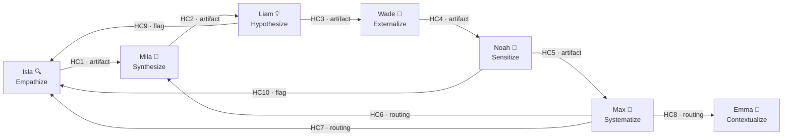

# The Vortex Deep Dive — Product Discovery from Context to Decision

**Team:** Vortex Pattern (7 Agents, 22 Workflows, 10 Handoff Contracts)
**Module:** Convoke (bme)
**Version:** 3.0.4
**Last Updated:** 2026-04-05

---

## What This Guide Covers

The per-agent user guides tell you *how to use each agent*. This guide tells you *how the team works together* — the pipeline logic, what flows between agents, what good artifacts look like, where teams get stuck, and how to navigate the system like someone who built it.

If you've read the individual user guides for Emma, Isla, Mila, Liam, Wade, Noah, and Max, you're ready for this.

---

## The Vortex at a Glance

The Vortex is a 7-stream product discovery framework based on the [Innovation Vortex](https://unfix.com/innovation-vortex) from the unFIX model. Each stream has a dedicated agent. Artifacts flow forward through handoff contracts, while feedback loops route backward when evidence demands it.

```
  Emma 🎯          Isla 🔍          Mila 🔬          Liam 💡          Wade 🧪          Noah 📡          Max 🧭
 Contextualize  →  Empathize  →   Synthesize  →   Hypothesize  →  Externalize  →   Sensitize  →   Systematize
 (strategy)       (research)      (convergence)   (hypotheses)    (experiments)    (production)     (decisions)
```

**The big idea:** You don't build features. You discover whether a problem is worth solving, for whom, and how — then you test that bet as cheaply as possible before committing resources. The Vortex gives that process structure.

---

## How to Read This Guide

This guide is organized around five layers:

1. **The Pipeline** — How artifacts flow from one agent to the next
2. **Walkthrough: A Complete Vortex Cycle** — Step-by-step through a realistic scenario
3. **Artifact Examples** — What good output looks like at each stage
4. **Scenarios & Entry Points** — Where to start depending on your situation
5. **Anti-Patterns** — Where teams go wrong and how to avoid it

---

## Part 1: The Pipeline

### Forward Flow (HC1-HC5)

The core pipeline moves artifacts forward through five handoff contracts:

| Contract | From | To | What Flows | In Plain English |
|----------|------|-----|-----------|------------------|
| **HC1** | Isla 🔍 | Mila 🔬 | Empathy artifacts (maps, interviews, observations) with synthesized insights | "Here's everything we learned from talking to users" |
| **HC2** | Mila 🔬 | Liam 💡 | Converged problem definition (JTBD + Pains & Gains + evidence) | "Here's the single problem worth solving, and why we believe it" |
| **HC3** | Liam 💡 | Wade 🧪 | 1-3 hypothesis contracts with risk maps and testing order | "Here are our bets, ranked by what could kill us fastest" |
| **HC4** | Wade 🧪 | Noah 📡 | Experiment context (results, baselines, success criteria) | "Here's what we tested and what happened — watch these signals in production" |
| **HC5** | Noah 📡 | Max 🧭 | Signal report (production intelligence + experiment lineage) | "Here's what production is telling us, mapped back to our original hypotheses" |

### Feedback Loops (HC6-HC10)

When evidence says "go back," these contracts route work backward:

| Contract | From | To | Trigger | In Plain English |
|----------|------|-----|---------|------------------|
| **HC6** | Max 🧭 | Mila 🔬 | Pivot decision — problem correct, solution wrong | "Our problem is real but our approach failed. Re-synthesize." |
| **HC7** | Max 🧭 | Isla 🔍 | Critical evidence gap identified | "We're missing something fundamental. Go find out." |
| **HC8** | Max 🧭 | Emma 🎯 | Problem space itself is wrong | "We've been solving the wrong problem entirely." |
| **HC9** | Liam 💡 | Isla 🔍 | Unvalidated lethal assumption detected mid-hypothesis | "This assumption could kill us and we have zero evidence. Validate before proceeding." |
| **HC10** | Noah 📡 | Isla 🔍 | Anomalous user behavior in production | "Users are doing something we never predicted. Investigate." |

### The Pipeline Diagram



**Isla is the gravity well.** She has three formal inbound feedback contracts (HC7, HC9, HC10) plus organic routing from multiple workflows. When in doubt, the Vortex sends you back to the user research.

---

## Part 2: Walkthrough — A Complete Vortex Cycle

Let's walk through a realistic scenario end-to-end. You're a product team at a B2B SaaS company exploring whether to build an onboarding assistant for new customers.

### Stage 1: Emma — Contextualize the Problem Space

**What you do:** Invoke Emma and run **[LP] Create Lean Persona** and **[PV] Define Product Vision**.

**Step-by-step through Lean Persona:**

| Step | What Emma Asks | What a Good Answer Looks Like |
|------|---------------|-------------------------------|
| 1. Define Job-to-be-Done | "What job is the user trying to accomplish?" | "New B2B customers need to configure their first integration within 48 hours of purchase so they see value before buyer's remorse sets in." (Specific job, not vague "onboard customers") |
| 2. Current Solution Analysis | "How do they solve this today? What hurts?" | "They read a 40-page setup guide, attend a 1-hour onboarding call, and still email support 2-3 times. Average time-to-first-value: 12 days." |
| 3. Problem Contexts | "When and where does this occur?" | "Immediately post-purchase. The champion who bought is under pressure to show ROI to their manager within 30 days." |
| 4. Forces & Anxieties | "What pushes/holds them?" | "Push: boss expects demo in 2 weeks. Hold: fear of breaking their existing integrations. Anxiety: 'What if I configured it wrong and corrupt our data?'" |
| 5. Success Criteria | "What does success look like?" | "First integration live within 48 hours. Zero support tickets during setup. Champion feels confident enough to onboard their own team." |
| 6. Synthesize | "What are your 3 riskiest assumptions?" | See artifact example below |

**What you get:** A lean persona artifact file like `lean-persona-setup-champion-2026-04-05.md` — a hypothesis about your user, their job, their pains, and what you need to validate.

**The Compass suggests:** Head to Isla (user-interview) to validate persona assumptions, or to Wade (lean-experiment) if you want to test the riskiest one immediately.

### Stage 2: Isla — Empathize Through Discovery

**What you do:** Invoke Isla and run **[UI] User Interview** to validate Emma's lean persona with real users.

Isla guides you through structuring interview questions around the JTBD and pains you identified. She helps you avoid leading questions and focus on behavior observation rather than opinion collection.

**What flows to Mila (HC1):** Empathy artifacts containing interview findings, key themes, pain patterns, and desired gains — all grounded in evidence from real conversations.

### Stage 3: Mila — Synthesize Into a Problem Definition

**What you do:** Invoke Mila and run **[RC] Research Convergence**.

Mila loads Isla's HC1 artifacts and converges them into a single, actionable problem definition. She uses JTBD framing and Pains & Gains analysis to distill multiple research inputs into one coherent picture.

**What flows to Liam (HC2):** A problem definition artifact with:
- A converged problem statement with confidence level
- Primary JTBD ("When [situation], I want to [motivation], so I can [expected outcome]")
- Prioritized pains with evidence sources
- Prioritized gains with expected impact
- An evidence summary showing traceability
- Embedded assumptions with validation status

### Stage 4: Liam — Engineer Testable Hypotheses

**What you do:** Invoke Liam and run **[HE] Hypothesis Engineering**.

Liam loads Mila's HC2 problem definition and turns it into 1-3 rigorous, falsifiable hypotheses using structured brainwriting and the 4-field contract format.

**Step-by-step:**

| Step | What Liam Does | What Matters |
|------|---------------|-------------|
| 1. Setup | Validates HC2 input — is the problem definition strong enough? | If the problem definition is weak, Liam sends you back to Mila |
| 2. Problem Context | Unpacks JTBD, pains, gains, and maps the hypothesis landscape | This is where Liam identifies which pains are most "hypothesis-worthy" |
| 3. Brainwriting | Engineers 1-3 hypotheses using the 4-field format | Each hypothesis has: Expected Outcome, Target Behavior Change, Rationale, Riskiest Assumption |
| 4. Assumption Mapping | Maps every assumption by lethality x uncertainty | The kill chart: what could destroy your idea, and how sure are you about it? |
| 5. Synthesize | Produces HC3 artifact with testing order | The riskiest assumption becomes the first experiment target |

**The HC9 flag:** If Liam encounters an assumption so dangerous and unvalidated that testing it without prior research is reckless, he flags it via HC9 and routes you back to Isla for targeted discovery. This is a safety valve — it prevents you from running experiments on foundations of sand.

**What flows to Wade (HC3):** 1-3 hypothesis contracts, each with the 4-field format, plus a risk map and recommended testing order.

### Stage 5: Wade — Run Lean Experiments

**What you do:** Invoke Wade and run **[LE] Lean Experiment**.

Wade loads Liam's HC3 artifact and designs the cheapest, fastest experiment to test the riskiest assumption first. He follows Build-Measure-Learn.

**Step-by-step through Lean Experiment:**

| Step | What Wade Does | What Matters |
|------|---------------|-------------|
| 1. Hypothesis | Loads hypothesis from HC3, confirms it's testable | The hypothesis statement becomes the experiment brief |
| 2. Design | Designs the experiment (type, audience, timeline) | Wade pushes for the cheapest valid test — a landing page over a prototype, a prototype over an MVP |
| 3. Metrics | Defines success criteria and measurement plan | "If we see X, the hypothesis is supported. If we see Y, it's invalidated." |
| 4. Run | Guides you through execution | The actual experiment happens outside the tool — Wade tracks it |
| 5. Analyze | Analyzes results against success criteria | Raw data becomes insight |
| 6. Decide | Experiment conclusion and next-step recommendation | Validated? Continue forward. Invalidated? Route to Max for a strategic decision |

**What flows to Noah (HC4):** Experiment context including results, baselines, success criteria, and which hypotheses were confirmed or rejected.

### Stage 6: Noah — Read Production Signals

**What you do:** Invoke Noah and run **[SI] Signal Interpretation**.

Noah loads Wade's HC4 experiment context and interprets production signals through the lens of your original hypotheses. He doesn't just report metrics — he maps them back to the bets you made.

**The HC10 flag:** If Noah detects user behavior that doesn't match any hypothesis — something completely unexpected — he flags it via HC10 and routes you back to Isla to investigate. Anomalies are discovery opportunities.

**What flows to Max (HC5):** A signal report containing signal descriptions, experiment lineage, and trend analysis. Intelligence only — no strategic recommendations (that's Max's job).

### Stage 7: Max — Make the Strategic Decision

**What you do:** Invoke Max and run **[PP] Pivot / Patch / Persevere**.

Max loads Noah's HC5 signal report (and any accumulated learning cards) and guides you through a rigorous strategic decision.

**Step-by-step:**

| Step | What Max Does | What Matters |
|------|---------------|-------------|
| 1. Evidence Review | Gathers all learning cards, experiment results, signals | Everything on the table — no cherry-picking |
| 2. Hypothesis Assessment | Scores each original hypothesis: confirmed, partial, invalidated | Honest assessment against evidence |
| 3. Option Analysis | Analyzes Pivot, Patch, and Persevere with pros/cons/risks | Forces you to consider all three options seriously |
| 4. Stakeholder Input | Captures team perspectives and concerns | Prevents unilateral decisions |
| 5. Decision | Documents the decision with rationale | The record says WHY, not just WHAT |
| 6. Action Plan | Creates concrete next steps for the chosen direction | A decision without an action plan is just an opinion |

**The routing from Max:**
- **Pivot** → HC6 to Mila (re-synthesize problem with new evidence)
- **Patch** → Back to Wade (adjust experiment and re-test)
- **Persevere** → HC7 to Isla (if deeper insight needed) or continue to next development phase
- **Wrong problem entirely** → HC8 to Emma (recontextualize)

---

## Part 3: Artifact Examples

### Lean Persona (Emma's Output)

```markdown
# Lean Persona: Setup Champion

## Job-to-be-Done
**When** a B2B customer purchases our platform,
**I want to** configure my first integration within 48 hours,
**so I can** demonstrate value to my manager before buyer's remorse sets in.

**Frequency:** Once per customer lifecycle (critical window)
**Importance:** Mission-critical — failure here drives churn

## Current Solution
- 40-page setup guide (avg. read time: never)
- 1-hour onboarding call (booked 5-7 days post-purchase)
- 2-3 support emails during setup
- Average time-to-first-value: 12 days

## Pain Points
1. **Gap between purchase excitement and first value** — 12-day gap kills momentum
2. **Fear of misconfiguration** — "What if I break our existing integrations?"
3. **Setup guide assumes expert knowledge** — new users don't know the terminology

## Riskiest Assumptions
1. ASSUMPTION: Customers would self-serve if the guide were interactive (not PDF)
2. ASSUMPTION: The 48-hour window is the real deadline (not 30 days)
3. ASSUMPTION: Fear of misconfiguration is the primary blocker (not complexity)
```

### HC2 Problem Definition (Mila's Output)

```markdown
## Converged Problem Statement
New B2B customers experience a critical 12-day gap between purchase and first
value realization, driven by configuration complexity and fear of breaking
existing integrations. This gap directly correlates with 60-day churn rate.

**Confidence:** Medium (5 interviews + support ticket analysis; no quantitative validation yet)

## Primary JTBD
When I purchase a new B2B platform,
I want to see it working with my data within 48 hours,
so I can justify the purchase to my manager and feel confident in my decision.

## Pains (Prioritized)
| Pain | Priority | Evidence |
|------|----------|----------|
| 12-day time-to-first-value | High | 5/5 interviewees cited frustration |
| Fear of misconfiguration | High | 4/5 interviewees delayed setup due to fear |
| Setup guide assumes expertise | Medium | 3/5 interviewees couldn't parse terminology |

## Assumptions
| Assumption | Risk if Wrong | Status |
|-----------|--------------|--------|
| 48-hour window is the real deadline | Solving for wrong urgency | Assumed |
| Fear > complexity as primary blocker | Wrong intervention design | Partially Validated |
```

### HC3 Hypothesis Contract (Liam's Output)

```markdown
## Hypothesis 1: Guided Setup Reduces Time-to-Value

**Expected Outcome:** Interactive setup wizard reduces time-to-first-value
from 12 days to under 48 hours for 70% of new customers.

**Target Behavior Change:** Customers complete first integration without
contacting support (currently 0% self-serve; target: 60%).

**Rationale:** Interview evidence shows customers abandon the PDF guide
within 5 minutes. Interactive guidance addresses both complexity and
fear-of-misconfiguration by providing guardrails.

**Riskiest Assumption:** Customers would actually use a self-serve wizard
instead of waiting for the onboarding call. (If they prefer human
guidance regardless, the wizard investment is wasted.)

## Assumption Risk Map
| Assumption | Lethality | Uncertainty | Priority |
|-----------|-----------|-------------|----------|
| Customers prefer self-serve over human onboarding | High | High | Test First |
| 48-hour window drives urgency | Medium | High | Test Soon |
| Fear of misconfiguration is solvable with UI guardrails | High | Medium | Test Soon |
```

---

## Part 4: Scenarios & Entry Points

Not every discovery starts at Stream 1. Here's where to enter the Vortex depending on your situation:

### "We have a new product idea but haven't talked to users yet"

**Start with:** Emma 🎯 → [LP] Lean Persona, then [PV] Product Vision
**Flow:** Emma → Isla (validate with users) → full forward pipeline

This is the classic greenfield path. Emma sets the strategic context, then Isla validates it with reality.

### "We have user research but it's scattered across docs and interviews"

**Start with:** Mila 🔬 → [RC] Research Convergence
**Flow:** Mila → Liam → Wade → Noah → Max

Skip Emma and Isla if you already have solid research. Mila will synthesize it into a problem definition. If Mila finds gaps in the research, she'll route you back to Isla.

### "We know the problem — we need hypotheses to test"

**Start with:** Liam 💡 → [HE] Hypothesis Engineering
**Flow:** Liam → Wade → Noah → Max

If you have a validated problem definition (or can write one that meets HC2 standards), jump straight to Liam.

### "We ran experiments but don't know what to do with the results"

**Start with:** Max 🧭 → [LC] Learning Card or [PP] Pivot / Patch / Persevere
**Flow:** Max decides the next direction

Max is the decision engine. Feed him evidence and he'll guide you through a structured decision.

### "We're in production and seeing weird signals"

**Start with:** Noah 📡 → [SI] Signal Interpretation
**Flow:** Noah → Max (for decision) or → Isla via HC10 (if anomalous)

Noah maps production behavior back to your original hypotheses. Unexpected behavior triggers deeper investigation.

### "We have everything — just need to navigate"

**Start with:** Max 🧭 → [VN] Vortex Navigation
**Flow:** Max runs a 7-stream gap analysis and tells you where you're weakest

Vortex Navigation is the GPS. It assesses your current state across all seven streams and recommends where to focus.

---

## Part 5: Anti-Patterns

### 1. "Demographic Persona Syndrome"

**The mistake:** Creating personas with names like "Sarah, 34, Marketing Manager, lives in Brooklyn, likes yoga."

**Why it fails:** Demographics don't predict behavior. A 34-year-old marketing manager and a 52-year-old engineering director can have the identical job-to-be-done. Emma will push back on this — lean personas focus on jobs, pains, and forces.

**The fix:** Start with the job. "When [situation], I want to [motivation], so I can [expected outcome]." Demographics are decoration; jobs are decision-drivers.

### 2. "Skipping Straight to Solutions"

**The mistake:** Going from Emma's lean persona directly to Wade's experiments without synthesizing the problem (Mila) or engineering hypotheses (Liam).

**Why it fails:** Without a converged problem definition, your experiments test vague ideas instead of specific hypotheses. Without explicit assumptions, you don't know what you're validating.

**The fix:** Respect the pipeline. Mila's convergence and Liam's hypothesis engineering are where vague intuitions become testable bets. You can move fast through them, but don't skip them.

### 3. "The Unfalsifiable Hypothesis"

**The mistake:** Writing hypotheses like "We believe users will like our product because it's better."

**Why it fails:** If you can't prove it wrong, it's not a hypothesis — it's a wish. Liam's 4-field format forces specificity: expected outcome (measurable), behavior change (observable), rationale (evidence-grounded), riskiest assumption (falsifiable).

**The fix:** Every hypothesis must have a riskiest assumption that, if wrong, kills the whole idea. If you can't name it, your hypothesis isn't specific enough.

### 4. "Sunk Cost Perseverance"

**The mistake:** Continuing to invest in a direction because you've already spent time/money on it, not because evidence supports it.

**Why it fails:** Evidence doesn't care about your budget. Max's Pivot / Patch / Persevere framework explicitly surfaces sunk-cost reasoning so you can recognize it.

**The fix:** Max requires you to analyze all three options (Pivot, Patch, Persevere) with evidence before deciding. "We've already invested X" is not evidence that the direction is correct — it's a cognitive bias.

### 5. "Ignoring the Feedback Loops"

**The mistake:** Treating the Vortex as a one-way conveyor belt: Emma → Isla → Mila → Liam → Wade → Noah → Max → done.

**Why it fails:** Discovery is iterative. Evidence will invalidate assumptions, reveal new problems, and surface surprises. The feedback loops (HC6-HC10) exist precisely because the forward path is rarely straight.

**The fix:** When Max says "pivot," trust the process and route back. When Liam flags an assumption (HC9), don't ignore it. When Noah sees an anomaly (HC10), investigate it. The loops are features, not failures.

### 6. "Testing Everything At Once"

**The mistake:** Running experiments on all three hypotheses simultaneously.

**Why it fails:** If multiple experiments run concurrently, you can't isolate which hypothesis is responsible for the signal. Liam's risk map exists to prioritize: test the riskiest assumption first, then the next.

**The fix:** Follow the recommended testing order from HC3. Test the assumption that could kill your idea first. If it survives, test the next one. Sequential testing is slower but produces clean evidence.

### 7. "Production Data Without Experiment Lineage"

**The mistake:** Treating production metrics as standalone signals without connecting them back to original hypotheses.

**Why it fails:** A metric going up means nothing without context. Noah's job is to interpret signals *through the lens of your hypotheses* — that's the experiment lineage. Without it, you're reacting to noise.

**The fix:** Always ensure Noah has Wade's HC4 experiment context before interpreting signals. The lineage is what turns data into intelligence.

---

## Quick Reference: Agent Cheat Sheet

| Agent | Stream | Core Question | Primary Workflows | Key Output |
|-------|--------|--------------|-------------------|------------|
| Emma 🎯 | Contextualize | Who are we building for and why? | Lean Persona, Product Vision, Contextualize Scope | Lean personas, product vision, problem scope |
| Isla 🔍 | Empathize | What do real users actually experience? | Empathy Map, User Interview, User Discovery | Empathy artifacts, interview findings, discovery research |
| Mila 🔬 | Synthesize | What's the single problem worth solving? | Research Convergence, Pivot Resynthesis, Pattern Mapping | HC2 problem definition (JTBD + Pains & Gains) |
| Liam 💡 | Hypothesize | What are our testable bets? | Hypothesis Engineering, Assumption Mapping, Experiment Design | HC3 hypothesis contracts with risk maps |
| Wade 🧪 | Externalize | What's the cheapest way to test this? | Lean Experiment, Proof of Concept, Proof of Value, MVP | Experiment results with baselines and success criteria |
| Noah 📡 | Sensitize | What is production telling us? | Signal Interpretation, Behavior Analysis, Production Monitoring | HC5 signal reports with experiment lineage |
| Max 🧭 | Systematize | What should we do with this evidence? | Learning Card, Pivot/Patch/Persevere, Vortex Navigation | Strategic decisions with rationale and action plans |

---

## Further Reading

- **Per-agent guides:** See `EMMA-USER-GUIDE.md` through `MAX-USER-GUIDE.md` in this directory for invocation details, menu options, and troubleshooting
- **Compass Routing Reference:** `_bmad/bme/_vortex/compass-routing-reference.md` — the authoritative routing table
- **Handoff Contract Schemas:** `_bmad/bme/_vortex/contracts/` — the exact artifact formats
- **Innovation Vortex (unFIX):** [unfix.com/innovation-vortex](https://unfix.com/innovation-vortex) — the original pattern this team implements

---

*The Vortex doesn't tell you what to build. It tells you what's worth building — and gives you the evidence to prove it.*
